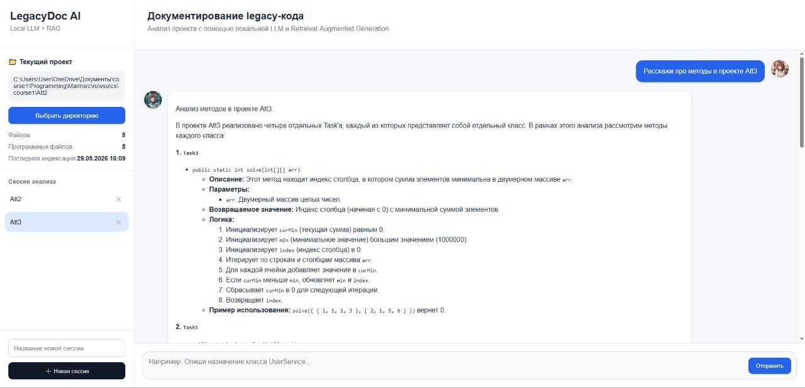
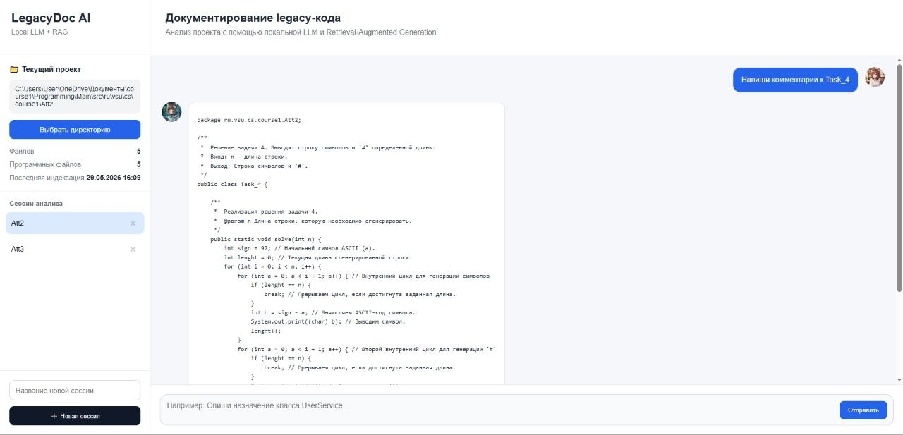

# LegacyDocAI

REST API приложение для управления и анализа документов с использованием AI-инструментов и современной backend-инфраструктуры.

  
  
  

## ✨ Функциональность

Приложение предоставляет ai чат-бота для документирования и комментирования программного кода:

| Модуль            | Описание                                       |
| ----------------- | ---------------------------------------------- |
| **AI Processing** | Интеллектуальная обработка и анализ документов |
| **Storage**       | Хранение и программных данных                  |
| **ChatHistory**   | Хранение контекста общения                     |
| **VectorStore**   | Хеширование чанков                             |

### Возможности системы

- 📄 Загрузка и индексация проекта
- 🤖 AI-анализ классов и функций
- 📝 Написание грамотных комментариев и документации
- 🐳 Поддержка Docker и Docker Compose

## 🛠 Технологический стек

- **Backend:** Java 17, Spring Boot, Spring AI
- **База данных:** PostgreSQL 15
- **Контейнеризация:** Docker, Docker Compose
- **Сборка:** Maven
## Скриншоты
|     |
|:------------------:|
| *Главная страница* |

|  |
|:-----------------------:|
| *Пример использования*  |

